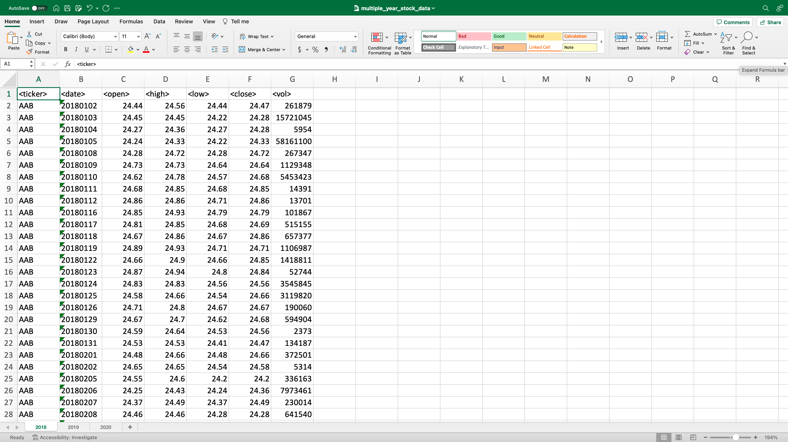
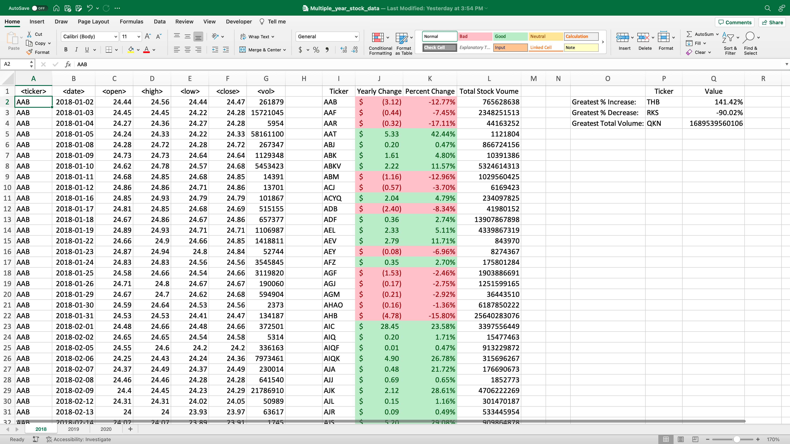

## Automating Tasks in Excel Using VBA

This is merely to demonstrate basic proficiency with VBA scripting.

The folder `Excel_VBA_Demo` contains an Excel workbook and a .bas script that runs VBA on that workbook.

- `multiple_year_stock_data.xlsx`
- `VBA_Stock_Data_3_Years.bas`

The VBA performs the following tasks on all pages of the workbook:

- Aggregate data grouped by stock ticker and list each distinct ticker in a separate area of the page.
- For all tickers, calculate new column values 'Yearly Change', 'Percent Change', and 'Total Stock Volume'.
- Add colored text and fill to 'Yearly Change' and 'Percent Change' columns, based on conditional formatting for positive or negative values.
- Determine which tickers showed the 'Greatest % increase', 'Greatest % decrease', and 'Greatest total volume', and display those values.

### Original Workbook

### Workbook After VBA Changes

